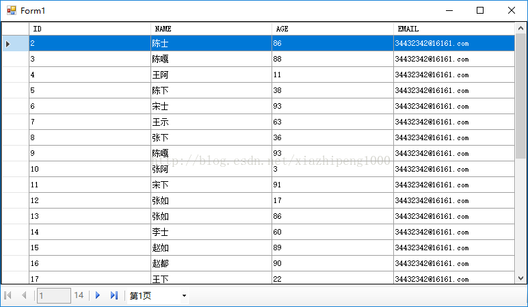

# csharpcode

#### 介绍
  c#分页
网上有很多这样的例子，但是没有自己想要的效果，所以今天花了点时间自己研究了一下，下面是效果图：

上面界面上主要用到的控件是panal，splitcontainer，bindingnavigator，datagridview这几个控件，具体的布局是先放一个panal（dock=fill），在用splitcontainer水平分割panal，上面那个panal1放datagridview下面那个放bindingnavigator，在bindingnavigator后面加一个combobox用户显示第几页，实现直接选择第几页的功能。